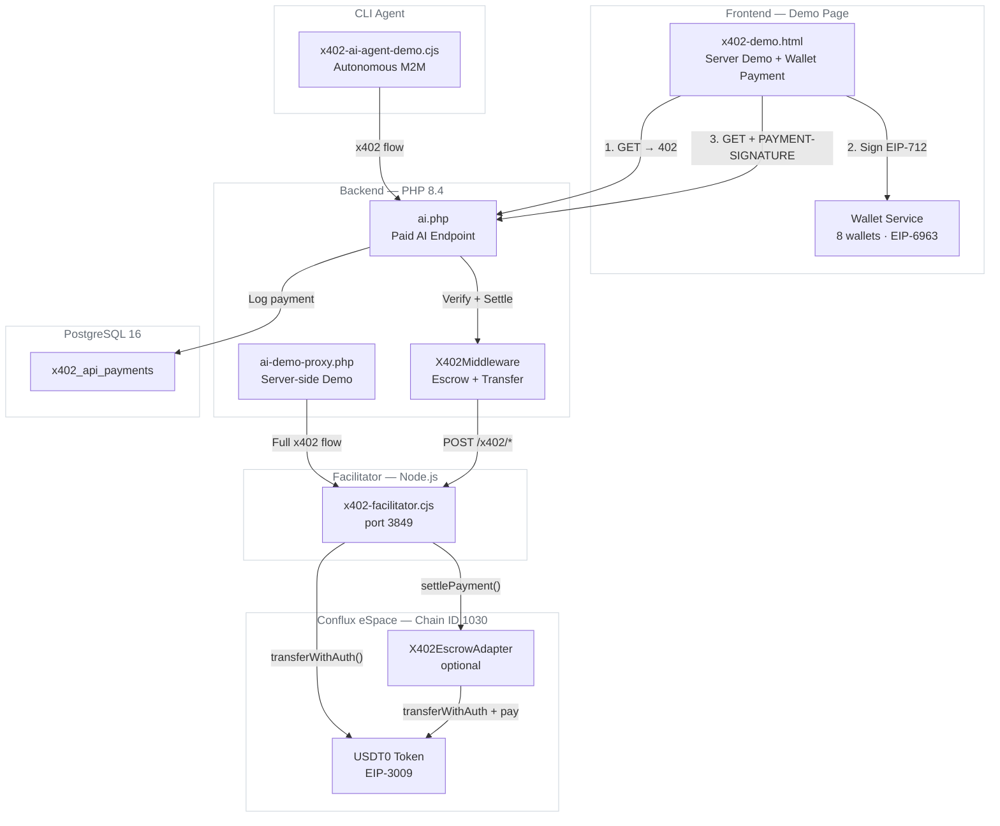
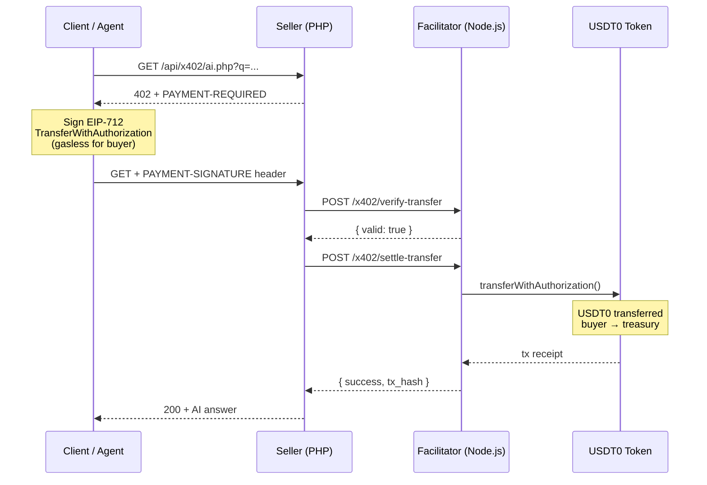
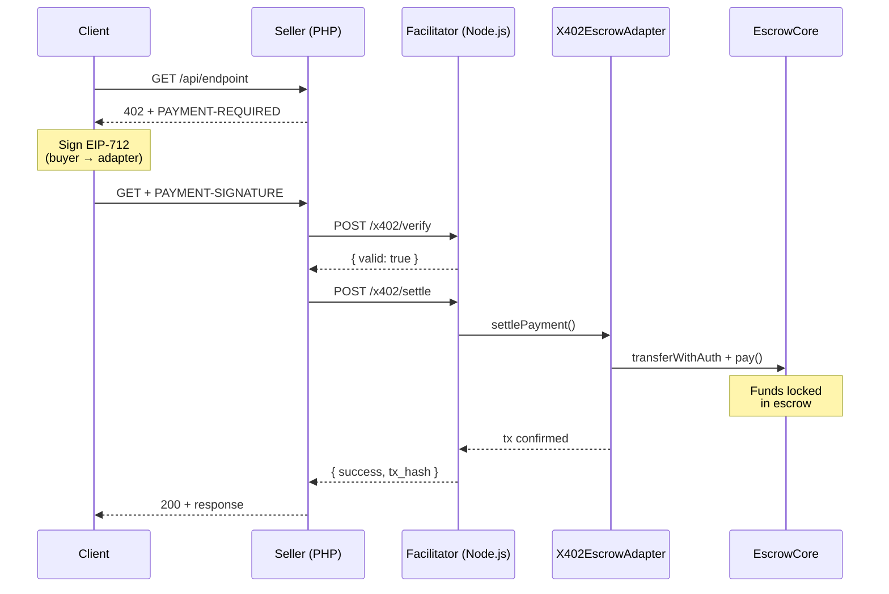
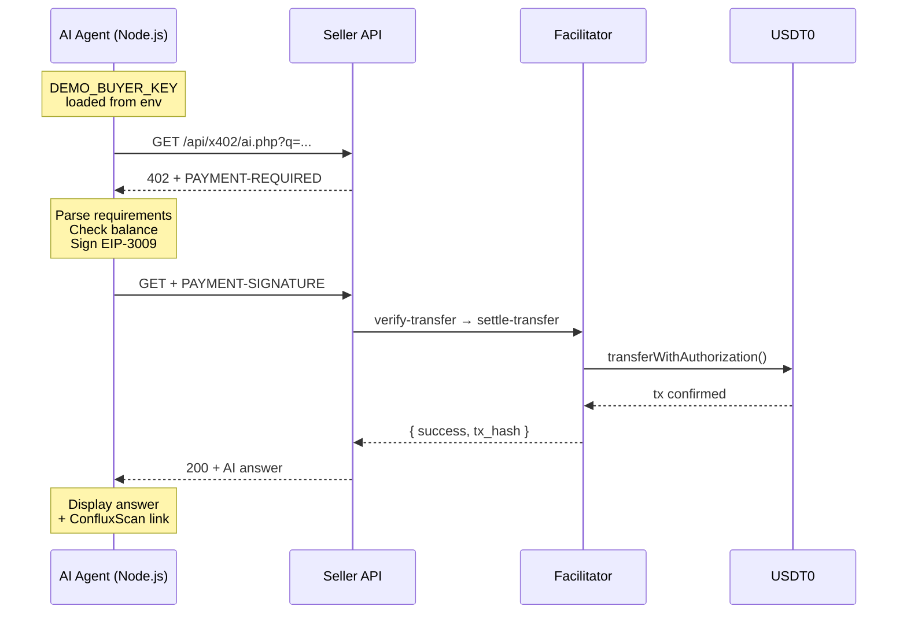

# x402 Boilerplate — Conflux eSpace

> Production-ready implementation of the [x402 protocol](https://www.x402.org) for paid AI APIs on **Conflux eSpace**

[](LICENSE)
[](https://nodejs.org/)
[](https://www.php.net/)
[](https://www.postgresql.org/)
[](https://confluxnetwork.org/)
[](https://www.x402.org)

Users pay **0.01 USDT0** per AI query via **EIP-3009 `transferWithAuthorization`** — gasless for the buyer, settled on-chain by the facilitator.

---

## Table of Contents

- [Overview](#overview)
- [Architecture](#architecture)
- [x402 Protocol Flow](#x402-protocol-flow)
- [Quick Start](#quick-start)
- [Environment Variables](#environment-variables)
- [Settlement Modes](#settlement-modes)
- [Supported Wallets](#supported-wallets)
- [Key Standards](#key-standards)
- [Security](#security)
- [License](#license)

---

## Overview

| Component | Description |
|-----------|-------------|
| **PHP Backend** | x402 middleware, paid AI endpoint (`/api/x402/ai.php`), demo proxy |
| **Facilitator** | Node.js server that verifies EIP-712 signatures & settles payments on-chain |
| **AI Agent** | Standalone CLI script — autonomous machine-to-machine payment demo |
| **Demo Page** | Two modes: server-side demo + browser wallet payment (8 wallets) |
| **Wallet Connect** | Production-tested multi-wallet: MetaMask, Fluent, OKX, WalletConnect (500+) |

---

## Architecture



### Project Structure

```
x402-boilerplate/
├── api/
│   ├── config/          # EnvLoader, Database (PostgreSQL)
│   ├── middleware/       # X402Middleware (escrow + transfer modes)
│   ├── utils/           # Response helper
│   └── x402/
│       ├── ai.php              # Paid AI endpoint (seller)
│       └── ai-demo-proxy.php   # Server-side demo proxy
├── assets/js/
│   ├── config/          # wallets.js, networks.js
│   ├── services/        # walletService, x402Service, web3Service, appkitService
│   └── components/      # walletModal
├── facilitator/
│   └── x402-facilitator.cjs    # x402 facilitator server (port 3849)
├── agent/
│   └── x402-ai-agent-demo.cjs  # Standalone CLI agent
├── database/
│   └── schema.sql              # PostgreSQL schema
├── tests/
│   └── integration.cjs         # 72 integration tests (npm test)
├── x402-demo.html              # Demo page (server + wallet modes)
├── docker-compose.yml
├── Dockerfile
└── .env.example
```

---

## x402 Protocol Flow

### Direct Transfer (Default)

Buyer signs EIP-3009 `transferWithAuthorization` — facilitator settles on-chain — USDT0 goes directly to treasury.



### Escrow Settlement (Optional)

For marketplace orders — funds locked in smart contract until delivery confirmation.



### AI Agent (CLI Demo)

Autonomous agent — no wallet UI, pure machine-to-machine payment:



---

## Quick Start

### 1. Clone & Configure

```bash
git clone https://github.com/confluxarena/x402-boilerplate.git
cd x402-boilerplate
cp .env.example .env
# Edit .env with your keys
```

### 2. Docker

```bash
docker compose up -d
# Open http://localhost
```

### 3. Manual Setup

**Requirements:** PHP 8.4+, PostgreSQL 16+, Node.js 20+

```bash
# Database
psql -U x402 -d x402 -f database/schema.sql

# Facilitator
npm install
npm run facilitator

# PHP (Apache/nginx)
# Point document root to this directory
```

### 4. AI Agent Demo (CLI)

```bash
npm install
DEMO_BUYER_KEY=0x... node agent/x402-ai-agent-demo.cjs "What is Conflux?"
```

### 5. Test the API

```bash
# Step 1: Get payment requirements
curl -i "http://localhost/api/x402/ai.php?q=What+is+Conflux"
# → HTTP 402 + PAYMENT-REQUIRED header (base64 JSON)

# Step 2: Run agent to pay and get answer
DEMO_BUYER_KEY=0x... API_URL=http://localhost/api/x402/ai.php \
  node agent/x402-ai-agent-demo.cjs "What is Conflux?"
```

### 6. Run Tests

```bash
npm test
# 72 integration tests: paths, consistency, security, EIP-712 domains
```

---

## Environment Variables

| Variable | Required | Description |
|----------|----------|-------------|
| `ARENA_SIGNER_PRIVATE_KEY` | Yes | Relayer wallet (pays gas for settlement) |
| `X402_API_TREASURY` | Yes | Treasury address (receives USDT0 payments) |
| `X402_FACILITATOR_KEY` | Yes | Shared secret (PHP ↔ Facilitator auth) |
| `CLAUDE_API_KEY` | Yes | Anthropic API key for AI responses |
| `DEMO_BUYER_KEY` | No | Demo wallet key (for server-side demo mode) |
| `DB_PGSQL_*` | Yes | PostgreSQL connection details |
| `X402_API_PRICE` | No | Price per query in token units (default: `10000` = 0.01 USDT0) |
| `CLAUDE_MODEL` | No | Claude model (default: `claude-3-5-haiku-20241022`) |
| `APP_URL` | No | App URL for CORS (default: `http://localhost`) |

---

## Settlement Modes

| Mode | Facilitator Route | Settlement Method | Use Case |
|------|-------------------|-------------------|----------|
| **Transfer** (default) | `/x402/verify-transfer` + `/x402/settle-transfer` | `token.transferWithAuthorization()` (direct) | API micropayments |
| **Escrow** (optional) | `/x402/verify` + `/x402/settle` | `X402EscrowAdapter.settlePayment()` → `EscrowCore.pay()` | Marketplace orders |

---

## Supported Wallets

| Wallet | Method | Notes |
|--------|--------|-------|
| MetaMask | EIP-6963 | Strict RDNS check (`io.metamask`) |
| Fluent | EIP-6963 + Hybrid | Best for Conflux, handles multi-wallet conflicts |
| OKX | Extension + WalletConnect | Auto-detects mobile, falls back to QR |
| WalletConnect | Reown AppKit CDN | 500+ wallets via QR scan |
| Halo, TokenPocket, Coinbase, Trust | Injected | Standard `window.ethereum` |

---

## Supported Tokens

| Token | Address | Decimals | EIP-3009 |
|-------|---------|----------|----------|
| USDT0 | [`0xaf37e8b6c9ed7f6318979f56fc287d76c30847ff`](https://evm.confluxscan.io/token/0xaf37e8b6c9ed7f6318979f56fc287d76c30847ff) | 6 | Yes |
| CNHT0 | [`0xded1660192d4d82e7c0b628ba556861edbb5cada`](https://evm.confluxscan.io/token/0xded1660192d4d82e7c0b628ba556861edbb5cada) | 6 | Yes |

---

## Key Standards

| Standard | Purpose |
|----------|---------|
| [x402 V2](https://www.x402.org) | HTTP 402 Payment Required protocol |
| [EIP-3009](https://eips.ethereum.org/EIPS/eip-3009) | `transferWithAuthorization` (gasless for buyer) |
| [EIP-712](https://eips.ethereum.org/EIPS/eip-712) | Typed structured data signing |
| [EIP-6963](https://eips.ethereum.org/EIPS/eip-6963) | Multi Injected Provider Discovery |
| [EIP-3085](https://eips.ethereum.org/EIPS/eip-3085) | `wallet_addEthereumChain` |

---

## Security

- Facilitator binds to `127.0.0.1` only — not exposed to internet
- API key authentication between PHP ↔ Facilitator
- Signature verification with signer recovery before settlement
- Balance and time window validation before execution
- Rate limiting on demo proxy (5 req/min per IP)
- One-time nonces for EIP-3009 (replay protection)
- Request body size limit (1 MB) on facilitator

---

## License

MIT

---

## Credits

Built by [Conflux Arena](https://confluxarena.org) for the Conflux ecosystem.
